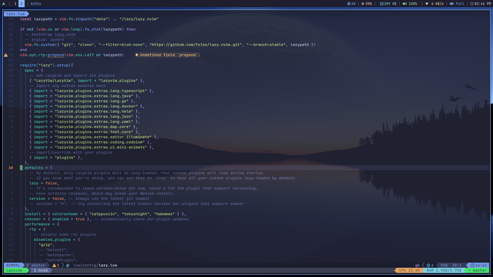

# dotfiles



## 🚀 Quick Setup

```bash
# Clone the repository
git clone https://github.com/pa-oshea/dotfiles.git ~/.dotfiles
cd ~/.dotfiles

chmod +x scripts/*.sh

# One-command setup for new machines
./scripts/quick-setup.sh

# Or manual setup
./install-nix.sh
./install.sh --languages rust node python go java
```

## 🎯 Installation

### Core

``` bash
./install.sh
```

### With Languages

```bash
./install.sh --languages rust node python go java
```

Development profile + language-specific tooling

## 🔧 Usage Examples

### Install Specific Package Sets

```bash
# Core tools only
nix-env -if ~/.dotfiles/nix/packages/core.nix

# Add language-specific tools
nix-env -if ~/.dotfiles/nix/packages/languages/rust.nix
nix-env -if ~/.dotfiles/nix/packages/languages/java.nix
```

### Language Runtime Management

```bash
# Use mise for runtime versions
mise install node@20.10.0
mise install python@3.12.0
mise install go@1.21.5
mise install rust@1.75.0

# Use SDKMAN for Java
sdk install java 21.0.1-tem
sdk install java 17.0.9-tem
sdk use java 21.0.1-tem
```

### Maintenance

```bash
# Update everything
./scripts/update-all.sh

# Update with system packages
./scripts/update-all.sh --system

# Preview updates
./scripts/update-all.sh --dry-run
```

### Override Settings

## 📚 Quick Commands

```bash
# Package management
nix-env -q                     # List installed packages
nix-env -e package-name        # Remove package
nix-env --rollback            # Rollback changes
nix-collect-garbage           # Clean up old packages

# Language management
mise list                     # Show installed runtimes
mise install node@latest     # Install latest Node.js
sdk list java                # Show available Java versions

# System maintenance
./scripts/update-all.sh       # Update everything
tmux-sessionizer             # Quick project switching
```

## 🆘 Troubleshooting

### Nix Issues

```bash
# Reinstall Nix
./scripts/install-nix.sh uninstall
./scripts/install-nix.sh install

# Reset packages
nix-env --rollback
```

### Shell Issues

```bash
# Reload configuration
source ~/.zshrc

# Reinstall plugins
rm -rf ~/.oh-my-zsh/custom/plugins/*
./install.sh dev
```

---

**One command to rule them all**: `./scripts/quick-setup.sh` 🚀

---

# Old README

## Linking

```
ln -s -r dunst ~/.config &
ln -s -r i3 ~/.config &
ln -s -r kitty ~/.config &
ln -s -r picom ~/.config &
ln -s -r polybar ~/.config &
ln -s -r rofi ~/.config &
ln -s -r zsh ~/.config &
ln -s -r .zshenv ~ &
ln -s -r .gitconfig ~ &
ln -s -r .tmux.conf ~ &
ln -s -r scripts/tmux-sessionizer.sh ~/.local/bin/ &
mv fonts/* ~/.local/share/fonts/
```

## Install

### Nix package manager

``` bash
sh <(curl -L https://nixos.org/nix/install) --no-daemon
```

```bash
nix-env -iA nixpkgs.git \
nixpkgs.zsh \
nixpkgs.neovim \
nixpkgs.tmux \
nixpkgs.fzf \
nixpkgs.lazygit \
nixpkgs.ast-grep \
nixpkgs.lazydocker \
nixpkgs.neofetch \
nixpkgs.jq \
nixpkgs.delta \
nixpkgs.ripgrep \
nixpkgs.fd \
nixpkgs.eza \
nixpkgs.tokei \
nixpkgs.atac \
nixpkgs.yazi \
nixpkgs.bat \
nixpkgs.xsel \
nixpkgs.lsd \
nixpkgs.tldr 
```

### Install oh-my-zsh

```bash
sh -c "$(curl -fsSL https://raw.githubusercontent.com/ohmyzsh/ohmyzsh/master/tools/install.sh)"
```

```bash fzf-tab
git clone https://github.com/Aloxaf/fzf-tab ${ZSH_CUSTOM:-~/.oh-my-zsh/custom}/plugins/fzf-tab
```

``` bash zsh-syntax-highlighting
git clone https://github.com/zsh-users/zsh-syntax-highlighting.git ${ZSH_CUSTOM:-~/.oh-my-zsh/custom}/plugins/zsh-syntax-highlighting
```

```bash zsh-completions
git clone https://github.com/zsh-users/zsh-completions ${ZSH_CUSTOM:-${ZSH:-~/.oh-my-zsh}/custom}/plugins/zsh-completions
```

```bash zsh-autosuggestions
git clone https://github.com/zsh-users/zsh-autosuggestions ${ZSH_CUSTOM:-~/.oh-my-zsh/custom}/plugins/zsh-autosuggestions
```

### zsh

```bash
chsh -s $(which zsh)
```

### [rust](https://www.rust-lang.org/)

```bash
curl --proto '=https' --tlsv1.2 -sSf https://sh.rustup.rs | sh
```

### [sdkman](https://sdkman.io/)

```bash
curl -s "https://get.sdkman.io" | bash
```

### [nvm](https://github.com/nvm-sh/nvm)

[Install](https://github.com/nvm-sh/nvm?tab=readme-ov-file#installing-and-updating)

### [neovim](https://github.com/neovim/neovim/blob/master/INSTALL.md)

[Build](https://github.com/neovim/neovim/blob/master/BUILD.md)

### [fzf](https://github.com/junegunn/fzf)

```bash
git clone --depth 1 https://github.com/junegunn/fzf.git ~/.fzf
~/.fzf/install
```

### [starship](https://starship.rs/)

```bash
curl -sS https://starship.rs/install.sh | sh
```

### [zoxide](https://github.com/ajeetdsouza/zoxide)

```bash
curl -sS https://raw.githubusercontent.com/ajeetdsouza/zoxide/main/install.sh | bash

```

### [lazygit](https://github.com/jesseduffield/lazygit)

```bash
go install github.com/jesseduffield/lazygit@latest
```

### [lazydocker](https://github.com/jesseduffield/lazydocker)

```bash
go install github.com/jesseduffield/lazydocker@latest
```

### [tmux](https://github.com/tmux/tmux/wiki/Installing)

| Platform         | Install Command     |
| ---------------- | ------------------- |
| Arch Linux       | pacman -S tmux      |
| Debian or Ubuntu | apt install tmux    |
| Fedora           | dnf install tmux    |
| RHEL or CentOS   | yum install tmux    |
| openSUSE         | zypper install tmux |

#### Dependencies

```bash
git clone https://github.com/tmux/tmux.git
cd tmux
sh autogen.sh
./configure && make
```

### [tpm](https://github.com/tmux-plugins/tpm)

```bash
git clone https://github.com/tmux-plugins/tpm ~/.tmux/plugins/tpm
```
